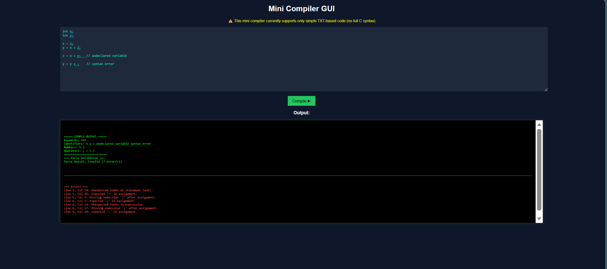

# 🔥 Mini Compiler GUI

A simple mini compiler with GUI built using:

- C (Compiler backend)
- Node.js (Server)
- HTML, CSS, JavaScript (Frontend)

## 🚀 Features

- Lexical Analysis
- Syntax Validation
- Semantic Analysis
- Intermediate Code (TAC)
- GUI with colored output (Green = Success, Red = Errors)

## ⚠️ Note

Currently supports only simplified TXT-style input (not full C syntax).

## 📦 Setup

```bash
npm install
node backend/server.js
```

🖥️ Run

Open frontend/index.html using Live Server

📸 Output
Green → Success
Red → Errors

## 📸 GUI Preview

<p align="center">
  
</p>

👨‍💻 Author
Naman Mamgain
